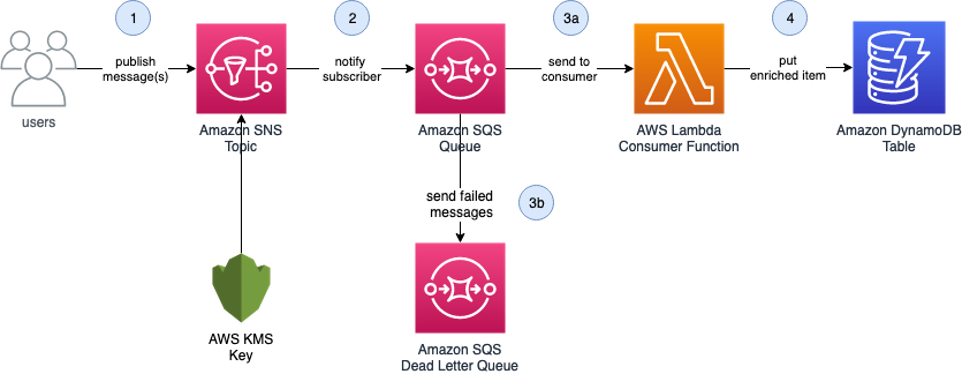

# Write AWS CDK Integration tests using CDK integ-test and CDK integ-runner constructs

## <!--BEGIN STABILITY BANNER-->


> **This is a stable example. It should successfully build out of the box**
>
> This example uses the core CDK library, and does not have any infrastructure prerequisites to build.

---

<!--END STABILITY BANNER-->

This example demonstrates how to write integration tests for your CDK applications using the [AWS CDK integ-test](https://docs.aws.amazon.com/cdk/api/v2/docs/integ-tests-alpha-readme.html) CDK construct and [integ-runner CLI Tool](https://github.com/aws/aws-cdk/tree/main/packages/%40aws-cdk/integ-runner).

Our example application is a serverless data enrichment application with persistence shown in Figure 1. CDK integration tests are written for this application under the ```integ-tests/``` folder. When these tests are run, it creates a separate integration test stack (a copy of your operational application) and runs the test against this isolated environment.



## Prerequisites

You should have a basic understanding of AWS CDK and event-driven architecture.

- An AWS account
- NodeJS and Npm are installed
- Install AWS CDK version 2.73.0 or later
- Clone this repository

## How to run

Configure your AWS CLI credentials in your terminal:
```bash
aws configure
```

Install the project dependencies:

```bash
npm install
```

Build the TS application:

```bash
npm run build
```

Run integration test:

```bash
npm run integ-test
```

To clean the generated build filed in Javascript run:

```bash
npm run clean
```

To lint the repository code according to the rules in .eslintrc.json run:

```bash
npm run lint:fix
```

## Helpful resources
For information on how to get started with these constructs, please refer to [AWS CDK Integ Test documentation](https://docs.aws.amazon.com/cdk/api/v2/docs/integ-tests-alpha-readme.html).

## Security

See [CONTRIBUTING](CONTRIBUTING.md#security-issue-notifications) for more information.

## License

This library is licensed under the MIT-0 License. See the LICENSE file.
